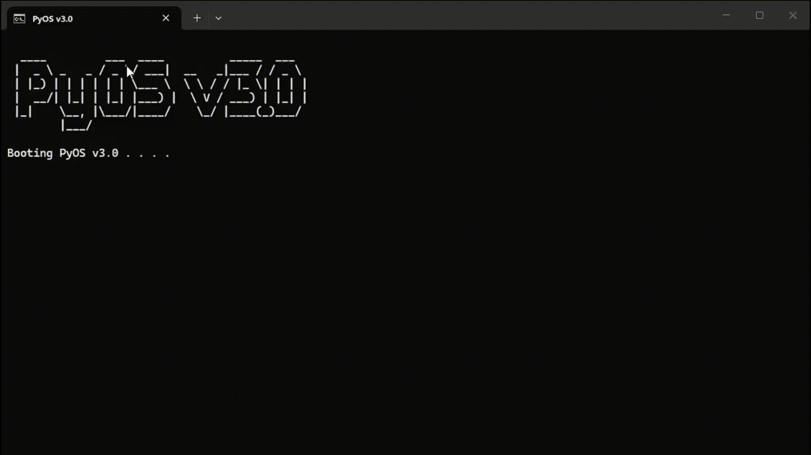
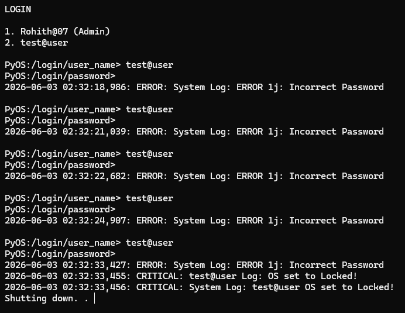
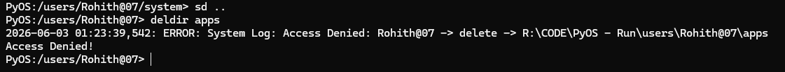
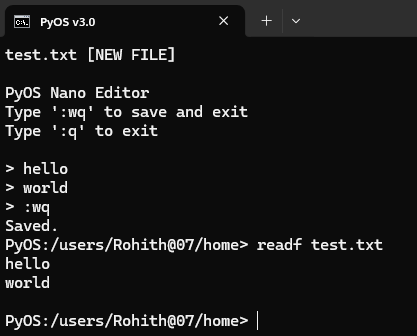
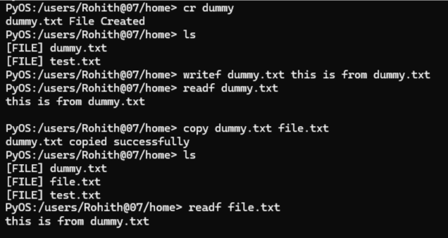
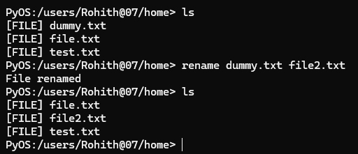
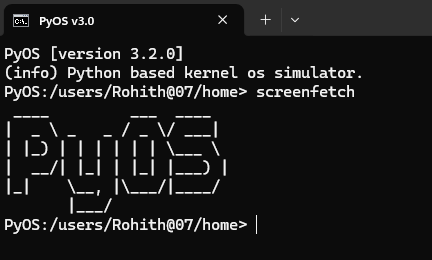

# 🚀 PyOS v3.2

> A Python-based Operating System Simulator built entirely from scratch.

## 🎬 Demo



PyOS is a terminal-driven operating system simulator developed using Python. It is designed to explore operating system concepts such as authentication, virtual filesystems, shell environments, security models, logging systems, application runtimes, and user management.

Unlike a real operating system kernel, PyOS runs entirely in user space and focuses on providing a realistic command-line operating system experience for learning, experimentation, and systems design practice.

---

# ✨ Features

## 🔐 Authentication System

* First-boot administrator setup
* Multi-user support
* Secure password hashing with salts
* Hidden password input using `getpass`
* Password validation policies
* Account lockout system after failed login attempts
* Administrative account recovery
* Separate user environments

---

## 📂 Virtual Filesystem

PyOS provides a secure virtual filesystem for each user.

Features:

* File creation
* File deletion
* Directory creation
* Directory deletion
* File reading
* File writing
* File copying
* File moving
* File renaming
* Built-in text editor
* Virtual path support
* Protected system directories

---

## 🛡️ Security Architecture

PyOS uses a layered security model.

### Roles

```text
PyOS
└── Admin
    └── User
```

### Security Features

* Role-based access control
* Path traversal protection
* Protected system files
* Protected system directories
* User isolation
* Reserved directory protection
* Secure path validation
* Account lock system

---

## 📜 Logging System

PyOS maintains detailed logs for troubleshooting and auditing.

### Available Logs

#### System Logs

Stores:

* Boot events
* Shutdown events
* Authentication events
* Security events
* Runtime errors

#### User Logs

Stores:

* Login activity
* Logout activity
* File operations
* Administrative actions

#### Backup Logs

Reserved for future backup and recovery features.

---

## 🎨 Theme Engine

PyOS supports multiple terminal themes.

Built-in themes:

* matrix
* ice
* bloodmoon
* ocean
* royal
* terminal
* ghost

Example:

```bash
theme matrix
```

---

## 🖥️ Shell Environment

PyOS includes:

* Command parser
* Permission-aware command execution
* Virtual path support
* Dynamic app launching
* Session management
* Restart support
* User isolation

Example prompt:

```bash
PyOS:/users/Rohith/home>
```

---

# 📸 Screenshots

### 🔐 Account Lockout Protection

After 5 failed login attempts, PyOS automatically locks the account and requires administrator intervention.



### 🛡️ Access Control

Protected directories and files cannot be modified by regular users.



### ✏️ Nano-style Text Editor

PyOS includes a lightweight built-in editor supporting file creation and editing.



#### File Copy



#### File Rename



### 🖥️ Screenfetch

Display system information and version details.



# 📖 Command Reference

## Filesystem Commands

### ls

Lists files and directories.

```bash
ls
```

---

### pwd

Displays current directory.

```bash
pwd
```

---

### sd

Changes directory.

```bash
sd <directory>
```

Examples:

```bash
sd Documents
sd ..
sd /
```

---

### cr

Creates a file.

```bash
cr <filename>
```

Examples:

```bash
cr notes
cr notes.txt
```

If no extension is provided, `.txt` is automatically added.

---

### crdir

Creates a directory.

```bash
crdir <directory>
```

---

### del

Deletes a file.

```bash
del <filename>
```

---

### deldir

Deletes an empty directory.

```bash
deldir <directory>
```

---

### readf

Reads a text file.

```bash
readf <filename>
```

Line-number mode:

```bash
readf notes.txt -l
```

---

### writef

Writes text into a file.

```bash
writef <filename> <content>
```

Example:

```bash
writef notes.txt Hello World
```

---

### edit

Built-in Nano-style text editor.

```bash
edit <filename>
```

Editor commands:

```text
:wq   Save and Exit
:q    Exit Without Saving
```

---

### rename

Renames a file or directory.

```bash
rename <old_name> <new_name>
```

---

### copy

Copies a file.

```bash
copy <source> <destination>
```

Example:

```bash
copy notes.txt backup.txt
```

---

### move

Moves a file.

```bash
move <source> <destination>
```

Example:

```bash
move notes.txt archive.txt
```

---

## System Commands

### help

Displays available commands.

```bash
help
```

---

### clear

Clears the terminal.

```bash
clear
```

---

### date

Displays current date.

```bash
date
```

---

### time

Displays current time.

```bash
time
```

---

### day

Displays current day.

```bash
day
```

---

### uptime

Displays system uptime.

```bash
uptime
```

---

### echo

Prints text to the terminal.

```bash
echo Hello World
```

---

### reverse

Reverses text.

```bash
reverse Hello
```

---

### screenfetch

Displays system information.

```bash
screenfetch
```

Version information:

```bash
screenfetch -v
```

---

## User Commands

### whoami

Displays current username.

```bash
whoami
```

---

### users

Lists available users.

```bash
users
```

Administrator only.

---

### adduser

Creates a new user account.

```bash
adduser
```

Administrator only.

---

### petname

Displays the configured assistant name.

```bash
petname
```

---

## Power Commands

### logout

Logs out current user.

```bash
logout
```

---

### restart

Restarts PyOS.

```bash
restart
```

---

### shutdown

Shuts down PyOS.

```bash
shutdown
```

---

## Application Commands

### apps

Lists installed applications.

```bash
apps
```

---

### run

Launches an application.

```bash
run <app_name>
```

Example:

```bash
run calculator
```

---

# 📂 Filesystem Layout

```text
PyOS/
│
├── main.py
├── auth.py
├── commands.py
├── fs.py
├── security.py
├── logger.py
├── boot.bat
│
├── system/
│   ├── config.json
│   ├── log.txt
│   └── backup/
│       ├── users/
│       └── logs/
│
├── users/
│   └── <username>/
│       ├── home/
│       ├── apps/
│       └── system/
│           ├── config.json
│           └── log.txt
│
└── apps/
    ├── calculator.py
    ├── notes.py
    ├── guess.py
    └── ...
```

---

# 🛡️ Protected Resources

The following resources cannot be modified by normal users:

### Protected Directories

```text
system/
apps/
home/
```

### Protected Core Files

```text
main.py
auth.py
commands.py
fs.py
security.py
logger.py
boot.bat
```

---

# ⚙️ Installation

## Requirements

* Python 3.10+
* Windows CMD Terminal

---

## Clone Repository

```bash
git clone <repository-url>
```

---

## Launch PyOS

Run:

```bash
boot.bat
```

Do not run:

```bash
python main.py
```

PyOS uses a dedicated bootloader process.

---

# 📜 Release Notes

## PyOS v3.2

### Added

* Complete virtual filesystem implementation
* File copy command
* File move command
* File rename command
* Nano-style text editor
* User activity logging
* Account lockout system
* Dedicated logger subsystem
* Virtual path resolution
* Protected system directories

### Changed

* Security architecture redesigned
* Password handling migrated to PasswordManager
* Password input migrated to getpass()
* Logging architecture redesigned
* Configuration management improved
* Filesystem architecture redesigned

### Fixed

* Path traversal vulnerabilities
* Directory protection bypasses
* Account lock bugs
* Logout logger crashes
* Session handling issues
* File permission inconsistencies
* Restart workflow issues

### Security

* Added AccessControl framework
* Added role-based permissions
* Added protected file handling
* Added reserved directory protection
* Added path validation system

---

# 🗺️ Roadmap

## v3.3

* tree command
* find command
* count command
* search command
* manual pages

## v3.4

* Backup system
* Recovery system
* Troubleshooting utilities

## v4.0

* App sandbox
* Package manager
* Application permissions
* Plugin support

---

# ⚠️ Current Limitations

* Windows-focused architecture
* No true multitasking
* No kernel-level isolation
* No app sandboxing yet
* Backup system still in development

---

# 🎓 Educational Purpose

PyOS is NOT a real operating system kernel.

PyOS is:

* An operating system simulator
* A systems programming project
* A shell architecture experiment
* A learning platform for OS concepts
* A practical Python engineering project

---

# 👨‍💻 Developer

Created by **Rohith**.

Built to explore:

* Operating systems
* Filesystem design
* Authentication systems
* Security models
* Command-line environments
* Software architecture

---

# 📄 License

This project is intended for learning, experimentation, and educational use.

---

# 🔥 Final Note

PyOS started as a simple Python terminal project and evolved into a structured operating system simulator featuring:

* Authentication
* Virtual filesystems
* Security controls
* User environments
* Runtime applications
* Logging infrastructure
* Theme support
* Administrative controls

> "Talk is cheap. Show me the code." — Linus Torvalds
